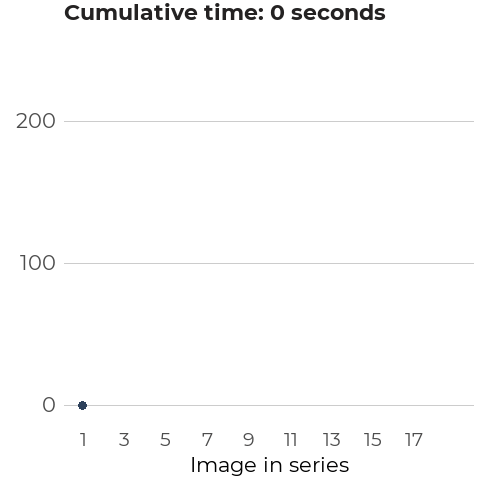

```{r setup, include=FALSE, echo=FALSE}

# options(htmltools.dir.version = FALSE)

library(xaringanthemer)
library(here)
library(abmi.themes)
library(dplyr)
library(stringr)
library(sf)
library(abmi.camera.extras)
library(ggplot2)
library(readr)

add_abmi_fonts()

style_duo_accent(
  primary_color = "#2D415B",
  secondary_color = "#A8AF8C",
  inverse_header_color = "#FFFFFF",
  header_font_google = google_font("Montserrat"),
  text_font_google = google_font("Montserrat"),
  code_font_size = "0.7rem"
)

```

## Outline

1. [Estimating Density](#density)

1. [Assumptions and Limitations](#assume)

1. [Use in Regional Monitoring](#monitor)

1. [Testing Assumptions](#test)

---
class: center, middle
name: density

# Estimating Density

---

## The ABMI uses (a version of) the REST model

REST = <ins>**R**</ins>andom <ins>**E**</ins>ncounter <ins>**S**</ins>taying <ins>**T**</ins>ime

--

### Central Tenets:

1. **Images taken at discrete intervals are converted into a measure of continuous time, in order to calculate how long the animal was in the camera field of view.** 

---

## The ABMI uses (a version of) the REST model

.pull-left[

]

.pull-right[

]

---

## The ABMI uses (a version of) the REST model

### Central Tenets:

1. Images taken at discrete intervals are converted into a measure of continuous time, in order to calculate how long the animal was in the camera field of view.

1. **Unlike quadrats, cameras do not survey a fixed area. We estimate an *effective detection distance* (EDD) for each combination of species, habitat type, and season.**

--

<div align="center">

</div>

---

## The ABMI uses (a version of) the REST model

### Central Tenets:

1. Images taken at discrete intervals are converted into a measure of continuous time, in order to calculate how long the animal was in the camera field of view.

1. Unlike quadrats, cameras do survey a fixed area. We estimate an *effective detection distance* (EDD) for each combination of species, habitat type, and season.

<br>

$$Density = \frac{\sum(N~*~T_f)}{A_f~*~T_0}$$
---

### Resources

--

ABMI report:

[Animal Density from Camera Data](https://abmi.ca/home/publications/501-550/516)

--

Code base:

[github.com/ABbiodiversity/mammals-camera](https://github.com/ABbiodiversity/mammals-camera)

--

Notable literature:

+ Rowcliffe et al (2008)
  - *Estimating Animal Density Using Camera Traps Without the Need for Individual Recognition*

+ Nakashima et al (2018) 
  - *Estimating Animal Density Without Individual Recognition Using Information Exclusively Derived From Camera Traps*

---

## The Goal

+ We want to be able to report on differences in species abundance either between areas, or over time. 

--

+ We want to use data collected from camera traps to make inferences about species' habitat associations.

---

## Important Assumptions

+ In order to estimate density in an area of interest, cameras are placed in a random systematic manner so that they are **surveying a representative sample** of the larger area.

--

+ Animals are not attracted to or repelled by the cameras - i.e. do not change their behaviour because of the cameras. 

--

+ Animals are certain to be detected within 5 metres of the camera.

---
class: center, middle
name: monitor

# Regional Monitoring

---

### Wildlife Management Units (WMUs)

Here is a map of them in Alberta:

--

.pull-right[
```{r eval=TRUE, echo=FALSE, include=TRUE, message=FALSE, warning=FALSE, fig.height=9}
ab_prov <- st_read(here("./data/ab_prov.shp"), quiet = TRUE, stringsAsFactors = FALSE)
ab_wmu <- st_read(here("./data/ab_wmu.shp"), quiet = TRUE, stringsAsFactors = FALSE)
ab_wmu_selection <- st_read(here("./data/ab_wmu_selection.shp"), quiet = TRUE, stringsAsFactors = FALSE) %>%
  st_transform("+init=epsg:4326")

ggplot(ab_prov) +
  geom_sf() +
  geom_sf(data = ab_wmu, color = "black") +
  # geom_sf(data = ab_wmu_selection, color = "blue", size = 1) +
  theme_minimal() +
  theme(axis.text = element_blank())
```
]

---

### Wildlife Management Units (WMUs)

Here is a map of them in Alberta:

.pull-left[Let's pick out a subset:

+ Algar Lake (WMU 519)
+ Winefred Lake (WMU 517)
+ Crow Lake (WMU 512)
+ Heart Lake (WMU 515)
]
.pull-right[
```{r eval=TRUE, echo=FALSE, include=TRUE, warning=FALSE, message=FALSE, fig.height=9}
ggplot(ab_prov) +
  geom_sf() +
  geom_sf(data = ab_wmu, color = "black") +
  geom_sf(data = ab_wmu_selection, color = "red", size = 1.25) +
  theme_minimal() +
  theme(axis.text = element_blank())
```
]

---
class: hide-logo
### Where are ABMI cameras? (...ish)

```{r eval=TRUE, echo=FALSE, include=FALSE, message=FALSE, warning=FALSE, out.width='100%', fig.height=7}
#library(leaflet)
#library(leaflet.extras)

#cam_abmi <- awesomeIcons(
#  icon = "camera",
#  iconColor = "black",
#  library = "ion",
#  markerColor = "white"
#)

#cam_bg <- awesomeIcons(
#  icon = "camera",
#  iconColor = "black",
#  library = "ion",
#  markerColor = "lightred"
#)

#cam_cmu <- awesomeIcons(
#  icon = "camera",
#  iconColor = "black",
#  library = "ion",
#  markerColor = "lightblue"
#)

sf_abmi <- st_read(here("./data/abmi_dep1.shp"), quiet = TRUE, stringsAsFactors = FALSE)
sf_bg <- st_read(here("./data/bg_dep.shp"), quiet = TRUE, stringsAsFactors = FALSE)
sf_cmu <- st_read(here("./data/cmu_dep.shp"), quiet = TRUE, stringsAsFactors = FALSE)

sf_abmi_selection <- sf_abmi %>%
  st_transform("+init=epsg:4326") %>%
  st_join(ab_wmu_selection, left = FALSE) %>%
  st_jitter(0.02) %>%
  st_set_geometry(NULL)

sf_bg_selection <- sf_bg %>%
  st_transform("+init=epsg:4326") %>%
  st_join(ab_wmu_selection, left = FALSE) %>%
  st_set_geometry(NULL)

sf_cmu_selection <- sf_cmu %>%
  st_transform("+init=epsg:4326") %>%
  st_join(ab_wmu_selection, left = FALSE) %>%
  st_set_geometry(NULL)

#map <- ab_wmu_selection %>%
#  st_transform("+init=epsg:4326") %>%
#  leaflet() %>%
#  addTiles() %>%
#  addProviderTiles("Stamen.TerrainBackground") %>%
#  addFullscreenControl() %>%
#  addScaleBar(position = "bottomright", options = scaleBarOptions(imperial = FALSE)) %>%
#  addPolylines(color = "#070707", weight = 3, smoothFactor = 0.2, opacity = 3, fill = FALSE) %>%
#  addAwesomeMarkers(data = sf_abmi_selection, icon = cam_abmi, group = "ABMI Grid") %>%
#  addAwesomeMarkers(data = sf_bg_selection, icon = cam_bg, group = "Bayne Big Grid") %>%
#  addAwesomeMarkers(data = sf_cmu_selection, icon = cam_cmu, group = "Caribou Monitoring Unit") %>%
#  addLayersControl(overlayGroups = c("ABMI Grid", "Bayne Big Grid", "Caribou Monitoring Unit"),
#                   options = layersControlOptions(collapsed = TRUE)) %>%
#  hideGroup(c("Bayne Big Grid", "Caribou Monitoring Unit"))

#htmlwidgets::saveWidget(map, file = here("./docs/map1.html"), selfcontained = TRUE)

```

<iframe src="map1.html" width="800" height="500"> </iframe>

---

### (Relative) Density Estimates

.left-code[
```{r eval=TRUE, warning=FALSE, message=FALSE}
library(abmi.camera.extras)

cameras <- ace_get_cam(
  aoi = ab_wmu_selection,
  group_id = WMUNIT_NAM,
  crs = 4326)

density <- ace_join_dens(
  x = cameras, 
  species = c(
    "Moose", "Black Bear"))
```
]

.right-plot[
```{r echo=FALSE, out.width="40%", fig.align="center", dpi=600}

```

```{r echo=FALSE, out.width="40%", fig.align="center", dpi=600}

```
]

---

### (Relative) Density Estimates

.left-code[
```{r eval=TRUE, warning=FALSE, message=FALSE}
library(abmi.camera.extras)

cameras <- ace_get_cam(
  aoi = ab_wmu_selection,
  group_id = WMUNIT_NAM,
  crs = 4326)

density <- ace_join_dens(
  x = cameras, 
  species = c(
    "Moose", "Black Bear"))
```
]

```{r plot, fig.show="hide", warning=FALSE, message=FALSE, echo=FALSE, eval=TRUE, fig.showtext=TRUE, dpi=600}
density <- density %>% filter(!is.na(common_name))

ggplot(data = density, aes(x = density, fill = common_name)) +
  geom_histogram(bins = 15) +
  coord_cartesian(ylim = c(0, 30)) +
  facet_grid(common_name ~ WMUNIT_NAM) +
  scale_fill_abmi(palette = "main") +
  labs(x = expression(Density~(individuals~per~km^2)),
       y = "Number of Deployments",
       title = "Distribution of density at\nindividual deployments.") +
  theme_abmi() +
  theme(legend.position = "none")
```

.right-plot[
`)
]

---

### (Relative) Regional Density

.left-code[
```{r warning=FALSE, message=FALSE}
summary <- 
  ace_summarise_dens(
  x = density,
  group_id = WMUNIT_NAM,
  conflevel = 0.9
)
```
]

```{r plot1, fig.show="hide", warning=FALSE, message=FALSE, echo=FALSE, eval=TRUE, fig.showtext=TRUE, dpi=600}
ggplot(data = summary, aes(x = WMUNIT_NAM, y = density_avg,
                           ymin = density_lci_0.9, ymax = density_uci_0.9,
                           color = common_name)) +
  geom_errorbar(width = 0.3, size = 1.25) +
  geom_point(size = 4) +
  coord_flip() +
  facet_wrap(~ common_name, nrow = 2) +
  scale_color_abmi(palette = "main") +
  labs(x = "",
       y = expression(Density~(individuals~per~km^2)),
       title = "Estimated density with 90% CI") +
  theme_abmi() +
  theme(panel.grid.major = element_blank(),
        legend.position = "none",
        strip.text = element_text(size = 14))
```

.right-plot[
`)
]

---
class: center, middle
name: CI

# How does this compare to established monitoring methods?

---
class: center, middle
name: moar

# Aerial Surveys!

---
class: hide-logo
# Methods comparison

```{r echo=FALSE, out.width="80%", fig.height=5, fig.align="center", fig.showtext=TRUE, warning=FALSE, message=FALSE, dpi=600}

aerial <- read_csv(here("data/aerial-moose-estimates_2014-2020.csv")) %>%
  mutate(WMUNIT_COD = paste0("00", WMUNIT_COD)) %>%
  select(WMUNIT_COD, density_aerial = density_avg)

wmu_dens <- ace_get_cam(ab_wmu, group_id = WMUNIT_COD) %>%
  ace_join_dens(species = "Moose") %>%
  ace_summarise_dens(group_id = WMUNIT_COD) %>%
  left_join(aerial, by = "WMUNIT_COD") %>%
  filter(!is.na(density_aerial)) %>%
  filter(n_deployments > 10,
         density_avg < 2)

wmu_dens %>%
  ggplot(aes(x = density_aerial, y = density_avg)) +
  geom_smooth(method = "lm", se = FALSE, color = "grey60") +
  #geom_abline(intercept = c(0, 0), linetype = 2) +
  geom_point(size = 3, color = "#2D415B") +
  theme_abmi() +
  labs(y = "Camera Density",
       x = "Aerial Density",
       title = "Comparison of Estimated Moose Densities",
       subtitle = "Monitoring conducted between 2014-2019.")

```

---
class: hide-logo
# Methods comparison

```{r echo=FALSE, out.width="80%", fig.height=5, fig.align="center", fig.showtext=TRUE, warning=FALSE, message=FALSE, dpi=600}

wmu_dens %>%
  ggplot(aes(x = density_aerial, y = density_avg)) +
  geom_smooth(method = "lm", se = FALSE, color = "grey60") +
  geom_abline(intercept = c(0, 0), linetype = 2, color = "darkred", size = 1) +
  geom_point(size = 3, color = "#2D415B") +
  theme_abmi() +
  labs(y = "Camera Density",
       x = "Aerial Density",
       title = "Comparison of Estimated Moose Densities",
       subtitle = "Monitoring conducted between 2014-2019.")

```

---
class: center, middle
name: assume

# Testing Assumptions

---
class: hide-logo
### Are animals attracted to the camera / pole?

--

If so, can we quantify how this influences time in front of the camera?

```{r echo=FALSE, fig.height=7, out.width="80%", fig.align="center", warning=FALSE, message=FALSE, dpi=600}

knitr::include_graphics(here("docs/moose.jpg"))

```

---
class: hide-logo
### Microhabitats

Do animals preferentially select for openings in forested stands?

--

.pull-left[
```{r echo=FALSE, out.width="95%", fig.align="center", dpi=600}

```
]
.pull-right[
```{r echo=FALSE, out.width="95%", fig.align="center", dpi=600}

```
]

---
### Are animals reliably captured within 5 metres of the camera?

.pull-left[
```{r echo=FALSE, out.width="95%", fig.align="center", dpi=600}
knitr::include_graphics("reindeer.jpg")
```
]
.pull-right[
```{r echo=FALSE, out.width="95%", fig.align="center", dpi=600}

```
]

---
## Questions?

<br>

Feel free to email me anytime!

[mabecker@ualberta.ca](mabecker@ualberta.ca)

<br>

## Thanks!


